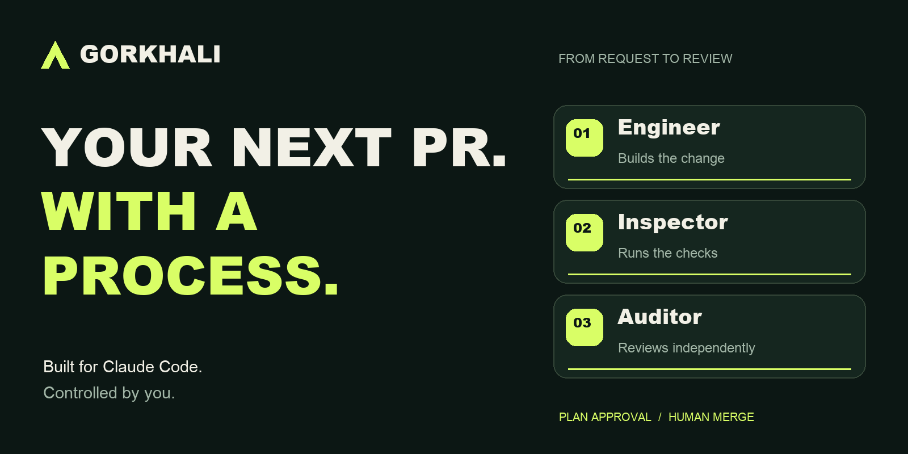

<p align="center">
  
</p>

<p align="center">
  <a href="https://github.com/karki011/Gorkhali/actions/workflows/ci.yml"></a>
  <a href="LICENSE"></a>
  
</p>

<p align="center">
  <strong>Give Claude Code a workflow you can trust and a process you can follow.</strong><br />
  Approved plans. Focused implementation. Independent checks and review.<br />
  You decide what gets built and what gets merged.
</p>

<p align="center">
  <a href="#get-started"><strong>Get started</strong></a> &nbsp; / &nbsp;
  <a href="#from-request-to-reviewed-pr">How it works</a> &nbsp; / &nbsp;
  <a href="project-docs/architecture.md">Read the architecture</a>
</p>

## Less orchestration on your plate

An AI-written change still needs a plan, checks, review, and a clear handoff.
**Gorkhali coordinates that work inside Claude Code**, with a small set of roles
and evidence attached to the change being reviewed.

| Build with a clear plan | Keep the review independent | Pick up interrupted work |
| :--- | :--- | :--- |
| Approve the scope before implementation starts. Work stays divided into coherent tasks. | Engineer implements. Inspector runs checks. Auditor reviews the integrated diff in a separate context. | Checkpoints preserve progress. Resume reconciles Git and invalidates stale verification before continuing. |

**One task at a time, on the integration branch.**
Every Engineer commits directly in the integration checkout, one task per wave, and
each task is integrated before the next is dispatched. Changes are integrated before
the final checks and review.

## Get started

Run these commands in Claude Code:

```text
/plugin marketplace add karki011/Gorkhali
/plugin install gorkhali@gorkhali
/gorkhali:start "Add a CSV export to the reports page"
```

Gorkhali uses a ticket number or URL from your request, or asks whether you have one.
You can explicitly continue without a ticket. It inspects the repository and
proposes a plan. Approve it, then let the
orchestrator delegate the work and bring back the verification and review results.
Shipping needs your authorization; merging stays with you.

**You'll need:** Git, Node.js 20+, and Claude Code with subagent identity in tool
hooks. Opening GitHub PRs also needs authenticated
`gh` and an `origin` remote. Claude Code is the only supported host today.

## From request to reviewed PR

| Step | What happens | Your control |
| :--- | :--- | :--- |
| **01 · Plan** | The orchestrator turns your request into scoped tasks and acceptance criteria. | Approve the plan before implementation. |
| **02 · Build** | Engineers implement one task at a time, directly on the integration branch, and each task is integrated before the next starts. | Scope changes come back for a decision. |
| **03 · Check** | After you confirm user-visible behavior with a human checklist, Inspector runs discovered repository checks once on the final integrated result. | Shape the result first; design changes cost no agent run. |
| **04 · Review** | Auditor independently examines correctness, requirements, security, and regressions on that same commit. | Read the findings before shipping. |
| **05 · Ship** | Gorkhali opens the PR and tracks external review feedback. | Authorize shipping. Merge when you're ready. |

The default execution trio is **Engineer, Inspector, Auditor**. Opposition joins
when planning is ambiguous or high risk. Detective joins when a failure needs
diagnosis. Model tiers follow deterministic risk rules, with bounded escalation
and repair attempts.

## Stop for the day. Keep the thread of the work.

```text
/gorkhali:pause
/gorkhali:resume
```

Pause creates an explicit handoff. Automatic checkpoints also support recovery
after an interruption without a prior pause, provided the session plan is readable.
Resume compares saved state with current Git reality. Changed content or Git
identity makes old verification stale; meaningful scope changes require approval.

Session data stays outside your project in `~/.gorkhali` by default. Gorkhali adds
no hosted service or daemon of its own.

## Eight commands. One workflow.

| Command | Use it to |
| :--- | :--- |
| `/gorkhali:start` | Plan and begin a feature, fix, or refactor |
| `/gorkhali:pause` | Save a stable handoff and stop dispatch |
| `/gorkhali:resume` | Reconcile Git and continue prior work |
| `/gorkhali:status` | See progress, blockers, and verification state |
| `/gorkhali:verify` | Run checks, independent review, and bounded recovery |
| `/gorkhali:wrap` | Open the PR and follow external review |
| `/gorkhali:close` | Clean up the session after human merge |
| `/gorkhali:learn` | Save an explicitly requested working preference |

## See the evidence

The repository includes automated tests for routing, real temporary Git repositories,
stale evidence, recovery, and hook enforcement. CI also installs the plugin into a
scratch Claude configuration to check that it loads.

[Explore the recorded MVP acceptance results](project-docs/acceptance.md) ·
[Read the implementation contracts](project-docs/architecture.md) ·
[Watch the two short product reels](marketing/README.md)

Version **3.5.1** reuses human visual approval for repairs that preserve the
approved experience. A new commit alone no longer asks you to reply "pass" again;
tests and applicable independent review still refresh. Only changed visual
acceptance or missing approval evidence needs a human decision.
[Read about visual approval reuse](references/visual-review.md).

Version **3.5.0** adds autonomous execution for well-scoped work with no open
questions and fewer than 300 added-plus-deleted implementation lines. Tests,
comment-only lines, and blanks do not count. Inspector measures the full diff and
Auditor reviews exclusions; larger or changed scope returns to explicit approval.
Eligible descriptions need no optional ticket question.
[Read the autonomy policy](references/autonomy.md).

**No explanatory code comments—in any mode.** This applies to autonomous and
manually approved work, large changes, tests, and repairs, with narrow exceptions
for required licenses and tool directives.
[Read the global comment rule](references/code-comments.md).

Version **3.4.0** removed worktree isolation and parallel waves. Every Engineer
commits directly on the integration branch, one task at a time, and each task is
integrated before the next is dispatched. The plan fields `isolation`,
`parallelSafe`, and `coordinationKeys` are accepted for saved-plan compatibility
and ignored. Version **3.3.1** made verification a single pass at wrap: human
visual review comes first and each design change is a plan amendment, then one
Inspector and one Auditor run on the final integrated commit. The `plan` action
reports when an amendment discards passed evidence, and Jira's `Reviewing` status
maps to the review stage by default. Version **3.3.0** added branch-mode isolation:
a single low-risk task in the last pending wave, with no other active Engineers,
ran directly on the integration branch instead of its own worktree. The
active-session pointer is keyed per checkout, so concurrent leads on one machine no longer see each other's session.
Once a PR exists and the last Auditor passed, verify accepts a current Inspector
pass alone under a configurable post-ship review policy, since external reviewers
re-review every push. Version **3.1.0** adds ticket intake and
lifecycle tracking. Jira and GitHub issues can follow work from assignment and In
Progress to PR-linked In Review and Done after merge. GitHub status transitions
use an existing Project Status field; Jira uses your connected tools and available
workflow transitions. Historical live acceptance receipts describe the version
they tested; they are not a guarantee for every repository or a token-saving
benchmark.

<details>
<summary><strong>Compatibility, boundaries, and upgrading from v2</strong></summary>

- Existing v2 plans remain valid and run sequentially without the new scheduling metadata. Legacy verification must run again.
- Standalone `review`, `fix`, `visual`, and PR-review-loop commands were removed. Use `verify` and `wrap`. The optional visual agent was removed; human visual confirmation remains.
- Clear work below the autonomous line limit uses recorded policy approval. Other plans and scope amendments need explicit approval. Ship authorization remains separate; merge is always human-controlled.
- Hooks enforce workflow discipline, not an OS sandbox for hostile repository code. Repository checks execute with the user's permissions.
- Repositories with submodules or special tracked files currently block fingerprinting. See the architecture before adopting Gorkhali for those layouts.
- Update Claude Code if subagent identity is unavailable; the edit gate does not guess an agent's identity.
- Override the external data directory with `GORKHALI_DATA`. Only one orchestrator should own a session.

</details>

<details>
<summary><strong>Contributing and local checks</strong></summary>

```sh
npm test
```

Repeat the [live acceptance checklist](project-docs/architecture.md#live-acceptance)
when preparing a release. [ROADMAP.md](ROADMAP.md) preserves historical decisions;
the current architecture and runtime contracts take precedence.

</details>

---

**Make the next change with a process behind it.**
[Start with Gorkhali](#get-started) · [Report an issue](https://github.com/karki011/Gorkhali/issues) · [MIT license](LICENSE)
